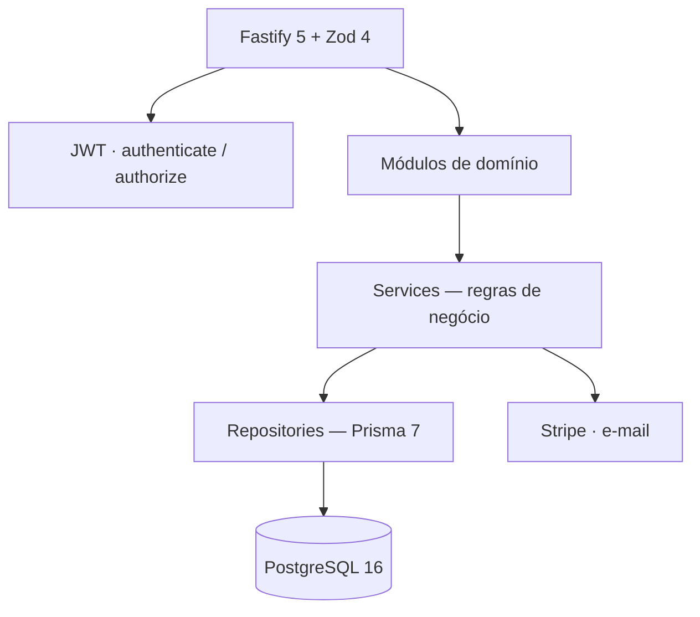

# OpenSGA API

Sistema de Gestão Acadêmica para IES brasileiras — projeto de estudo profissional.

API REST com identidade, currículo, matrícula, diário, financeiro (Stripe) e conformidade MEC.

[Node.js](https://nodejs.org/)
[TypeScript](https://www.typescriptlang.org/)
[Fastify](https://fastify.dev/)
[Prisma](https://www.prisma.io/)
[PostgreSQL](https://www.postgresql.org/)
[Stripe](https://stripe.com/)

[Documentação](#documentação) · [O que demonstra](#o-que-este-projeto-demonstra) · [Arquitetura](#arquitetura) · [Instalação](#instalação) · [Demo](#acesso-de-demonstração)

---

## Documentação

Contrato vivo (Scalar / OpenAPI):

| Ambiente | Docs | Health |
| :--- | :--- | :--- |
| Local | [http://localhost:3333/docs](http://localhost:3333/docs) | [http://localhost:3333/health](http://localhost:3333/health) |
| Produção (Render) | [https://opensga-api.onrender.com/docs](https://opensga-api.onrender.com/docs) | [https://opensga-api.onrender.com/health](https://opensga-api.onrender.com/health) |

Webhook Stripe em produção: `POST https://opensga-api.onrender.com/webhooks/stripe` (secret do endpoint no Dashboard, não o `whsec_` do `stripe listen`).

BRD e spec de testes (BDD `QA-*`): [`docs/`](./docs).

---

## O que este projeto demonstra

Estudo de um SGA/ERP universitário: da matrícula à avaliação, com regras acadêmicas reais (MEC) e cobrança via Stripe.

| Decisão                          | Por quê importa                                                          |
| -------------------------------- | ------------------------------------------------------------------------ |
| Arquitetura hexagonal por módulo | Separação `route → controller → service → repository`                    |
| RBAC com JWT                     | Papéis `ADMIN`, `PROFESSOR`, `ALUNO`, `RESPONSAVEL`                      |
| Domínio acadêmico                | Matriz curricular, Decreto 12.456/2026, extensão ≥ 10%, notas AV/AVS/AV3 |
| Stripe no servidor               | Catálogo, inscrição pública, Checkout (cartão/boleto) e webhook          |
| Contrato vivo                    | OpenAPI + Scalar em [`/docs`](https://opensga-api.onrender.com/docs)     |

---

## Arquitetura



Stack: **Node 24**, TypeScript, Fastify 5, Zod 4, Prisma 7 (`@prisma/adapter-pg`), PostgreSQL 16, Stripe, Nodemailer.

Cada módulo em `src/modules/` tem o mesmo recorte (`-route`, `-controller`, `-service`, `-repository`, `-schemas`). O SDK Stripe vive só em `src/lib/stripe.ts`.

---

## Instalação

**Requisitos:** Node.js **24.x** (`engine-strict`), Docker Compose, npm.

```bash
git clone <url-do-repositorio> opensga-api && cd opensga-api
cp .env-example .env          # preencha JWT_SECRET; Stripe é opcional
docker compose up -d          # PostgreSQL 16 em :5432
npm install
npx prisma generate --config prisma7.config.ts
npx prisma migrate dev --config prisma7.config.ts
npx prisma db seed --config prisma7.config.ts
npm run dev
```

| URL | Uso |
| :--- | :--- |
| [http://localhost:3333/health](http://localhost:3333/health) | liveness local |
| [http://localhost:3333/docs](http://localhost:3333/docs) | Scalar local |
| [https://opensga-api.onrender.com/health](https://opensga-api.onrender.com/health) | liveness publicado |
| [https://opensga-api.onrender.com/docs](https://opensga-api.onrender.com/docs) | Scalar publicado |

Variáveis: [`.env-example`](./.env-example). Obrigatórias para subir: `DATABASE_URL` e `JWT_SECRET`. Stripe, SMTP e Cloudinary só entram se for exercitar cobrança ou e-mail.

Webhook Stripe (opcional)

```bash
stripe listen --forward-to localhost:3333/webhooks/stripe
```

No ambiente local, cole o `whsec_...` em `STRIPE_WEBHOOK_SECRET` e reinicie a API. Em produção, cadastre o endpoint `https://opensga-api.onrender.com/webhooks/stripe` no Dashboard Stripe e use o secret daquele endpoint. Sem webhook válido, a matrícula não passa de `PRE_MATRICULADO` para `ATIVO`.

---

## Acesso de demonstração

Login: `POST /api/v1/auth/login` com `{ "identificador", "senha" }` (e-mail, CPF, RA ou matrícula). Header: `Authorization: Bearer <token>`.

| Papel       | Identificador            | Senha              |
| ----------- | ------------------------ | ------------------ |
| `ADMIN`     | `testeadmin@opensga.dev` | `Admin@123456`     |
| `PROFESSOR` | `professor@opensga.dev`  | `Professor@123456` |
| `ALUNO`     | `aluno@opensga.dev`      | `Aluno@123456`     |

O seed monta `SEDE-REC` (campus presencial) e `POLO-EAD` (polo EAD), 10 cursos, matrizes 2026.1, turmas por curso, diários e faturas.

---

## Superfície da API

Prefixo de negócio: `/api/v1`. Inscrição pública também em `/api` (sem versão).

| Área        | Exemplos                                                                                                     | Acesso                                       |
| ----------- | ------------------------------------------------------------------------------------------------------------ | -------------------------------------------- |
| Auth        | `/auth/login`, `/auth/me`, `/auth/senha`                                                                     | público / JWT                                |
| Usuários    | `/users`, `/users/professores`, `/users/alunos`                                                              | `ADMIN`                                      |
| Acadêmico   | `/academic/campi` … `/cursos` … `/matrizes` … `/turmas`                                                      | `ADMIN`¹                                     |
| Matrícula   | `/matriculas`                                                                                                | `ADMIN`                                      |
| Diário      | `/diario`, `/diario/enturmar`, `/diario/avaliar`, `/diario/fechar-semestre`                                  | `ADMIN` + titular                            |
| Financeiro  | `/financeiro/precos`, `/faturas`                                                                             | `ADMIN`                                      |
| Ingresso    | `GET /api/catalogo`, `POST /api/inscricao`, `POST /api/checkout`                                             | público                                      |
| Webhook     | `POST /webhooks/stripe`                                                                                      | assinatura Stripe                            |
| Comunicação | `/comunicados`, `/ouvidoria/reclamacoes`                                                                     | `ADMIN` (GET comunicados também `PROFESSOR`) |
| Dashboard   | `/dashboard/admin`, `/dashboard/professor`                                                                   | papel correspondente                         |
| Documentos  | `/documentos/modelos`                                                                                        | `ADMIN`                                      |
| Portal      | `GET /portal/contexto`, `GET /portal/documentos`, `POST /portal/documentos/emitir`, `POST /portal/ouvidoria` | `ALUNO` / `RESPONSAVEL`                      |

¹ GET de turmas também para `PROFESSOR` (somente as suas).

---

## Licença

ISC. Projeto de estudo — não é homologação MEC.
